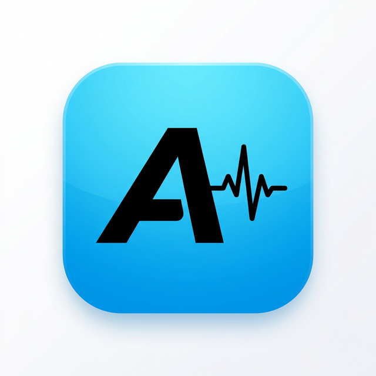
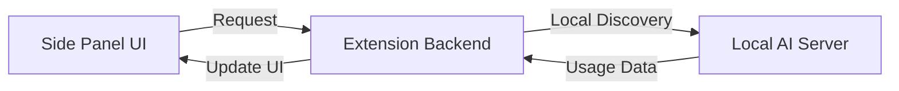

<p align="center">
  
</p>

<h1 align="center">Antigravity Monitor</h1>

<p align="center">
  <a href="https://github.com/luonglh90/antigravity-monitor">
    
  </a>
  <a href="https://github.com/luonglh90/antigravity-monitor">
    
  </a>
  <a href="https://open-vsx.org/extension/Notalab/notalab-antigravity-quota">
    
  </a>
</p>

---

Monitor Antigravity AI agent status and model quotas directly inside VS Code.

Antigravity Monitor is a VS Code extension that provides a real-time dashboard for tracking your Gemini and Claude model usage. It helps you stay within your quota limits by showing remaining usage and reset times.

## Features

- **Real-time Quotas**: View remaining quota for Claude and Gemini model families.
- **Credit Tracking**: Monitor your Prompt and Flow credits directly in the header.
- **Urgency Indicators**: Color-coded reset times help you quickly identify when your models will be available again.
- **Side Panel Integration**: Access your dashboard directly from the VS Code Activity Bar for a seamless, always-on experience.
- **Local Session Monitoring**: Automatically detects your active AI assistant session (e.g., Codeium/Antigravity) without requiring manual login.
- **Heartbeat Status**: Keep track of the health and availability of your local AI assistant.

## Usage

1. **Activity Bar**: Click on the **Antigravity Monitor** icon (the stylized 'A' with a heartbeat) in the VS Code Activity Bar on the left.
2. **Side Panel**: The dashboard will open instantly in the side panel, showing your current local session status and model quotas.
3. **Command Palette**: You can also use `Antigravity Monitor: Open Dashboard` from the Command Palette (`Cmd+Shift+P`) to focus the monitor.

## Development Setup

### Building

To build both the frontend and backend:

```bash
npm install
npm run build:all
```

To package the extension for personal use or upload:

```bash
npm run vsce:package
```

To run the extension in development mode, open the project in VS Code and press `F5` to start the Extension Development Host.

## How It Works



Antigravity Monitor operates as a bridge between your local development environment and the VS Code UI:

1. **Local Discovery**: The extension automatically detects the running Antigravity Language Server on your machine using local process discovery.
2. **Seamless Authentication**: It extracts session information and security tokens directly from the local environment, enabling "zero-config" login.
3. **Data Aggregation**: The backend service fetches raw model usage data, groups them into logical families (like Gemini and Claude), and calculates precise reset timestamps.
4. **Real-time Dashboard**: A React-based webview renders this data into a modern, responsive dashboard inside your Side Panel.

## Technical Overview

Antigravity Monitor works by bridging a Next.js-based webview with a background service in the VS Code extension. It communicates with a local language server process to retrieve high-fidelity status information and model availability.

For more details, see [docs/ARCHITECTURE.md](./docs/ARCHITECTURE.md).
