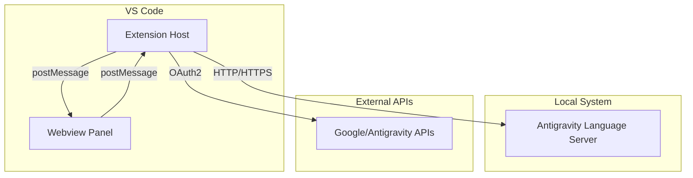

# Technical Architecture - Antigravity Monitor

This document describes the technical design and internal workings of the Antigravity Monitor extension.

## High-Level Overview

Antigravity Monitor consists of two main parts:
1. **VS Code Extension (Backend)**: Manages the extension lifecycle, commands, and secure communication with local processes and APIs.
2. **Webview UI (Frontend)**: A modern React-based dashboard that visualizes quota and agent data.

## Backend Implementation

### Extension Entry Point (`backend/extension.ts`)
The `activate` function registers the `antigravity-monitor.open` command. When triggered, it:
- Creates a `WebviewPanel`.
- Resolves the local filesystem paths for the bundled UI assets in `frontend/dist`.
- Injects the HTML content into the webview.
- Sets up a message listener to handle requests from the UI (e.g., `login`, `fetchQuotas`).

### Local Language Server Client (`backend/localLanguageServerClient.ts`)
The extension monitors a local `language_server_` process to fetch the current user's status.
- **Process Discovery**: Uses `ps aux` and `lsof` to find the running language server and its listening ports.
- **CSRF Protection**: Extracts `--csrf_token` and `--extension_server_csrf_token` from the process arguments to authenticate requests.
- **Probing**: Probes discovered ports using `GetUserStatus` endpoints to find the active "connect port".

### Quota Service (`backend/quotaService.ts`)
Provides a higher-level abstraction for fetching model quotas from Antigravity endpoints.
- **Authentication**: Uses VS Code's built-in `AuthenticationProvider` (Google or custom Antigravity) to obtain OAuth2 tokens.
- **Reliability**: Implements exponential backoff and jitter for handling 429 (Rate Limit) and 5xx (Server Error) responses.
- **Normalization**: Groups raw model data into logical families (Claude, Gemini) and calculates percentage-based remaining usage.

## Frontend Implementation

The frontend is a `Next.js` application exported as a static site and served via the VS Code webview.

### Communication Bridge
The UI uses a `vscode` library wrapper (`frontend/src/lib/vscode.ts`) to interact with the extension host via `window.postMessage`.

### Dashboard Components
- **Header**: Displays the current authenticated account and refresh controls.
- **GlobalStats**: High-level summary of usage across all model families.
- **ModelsQuota**: Detailed progress bars for specific model versions.
- **ActiveAgents**: Real-time simulation of running AI agents.

## Data Flow: Fetching Quotas

1. User clicks "Refresh" in the Dashbord UI.
2. UI sends `fetchQuotas` message to the extension.
3. Extension calls `fetchLocalUserStatus` in `localLanguageServerClient.ts`.
4. Client finds the LS process, authenticates with CSRF tokens, and returns raw JSON status.
5. Extension forwards the status data back to the UI via `quotaData` message.
6. UI updates its state and re-renders the charts and lists.
